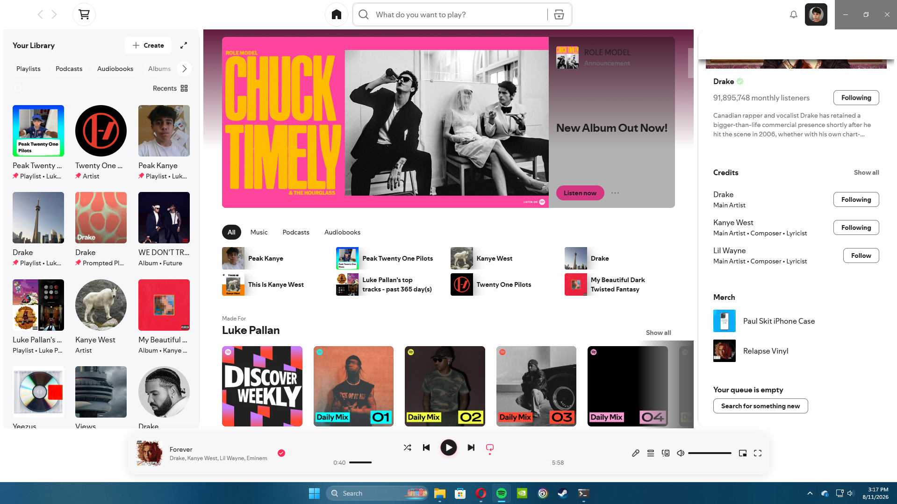

# Apple-Music-for-Spotify
Apple music on macos as close as possible to apple music
# Apple Music for Spotify

A Spicetify theme inspired by the look and feel of Apple Music on macOS.



## Features

- Apple Music-inspired light interface
- macOS-style colors and spacing
- Light search and navigation controls
- Translucent player design
- Redesigned side panels
- Red and white play button
- Rounded album artwork

## Requirements

- Spotify Desktop
- Spicetify

## Installation

1. Download this repository.
2. Copy the theme folder into your Spicetify `Themes` directory.
3. Set the theme with:

```powershell
spicetify config current_theme "Apple Music"
spicetify config color_scheme AppleDark
spicetify apply

## Compatibility

✅ MacOS
✅ Windows
